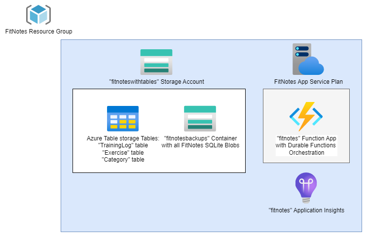
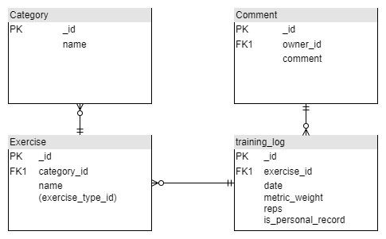
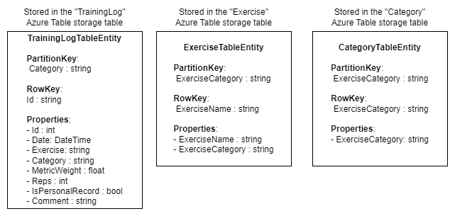

# FitNotes
This repository is a simple project used for getting some hands-on experience with both Azure Durable Functions, as well as Azure Table storage.
It revolves around the Android app "FitNotes" and the backups this allows you to store. The idea is that these backups are parsed, and then stored into an Azure Storage Account in Azure Table storage, via an upload of a FitNotes SQLite backup uploaded as an Azure Storage Blob triggering an Azure Durable Functions Orchestration.

## Azure Resources
A single Resource Group contains a set of Resources realizing this project: 
 

## FitNotes DB Schema & Azure Table storage tables
The "FitNotes" Android app backups are just SQLite files with a ".fitnotes" suffix.
The tables and relevant columns for this repositories is given below:  

Leading to the following set of Azure Table storage Tables:  
 
